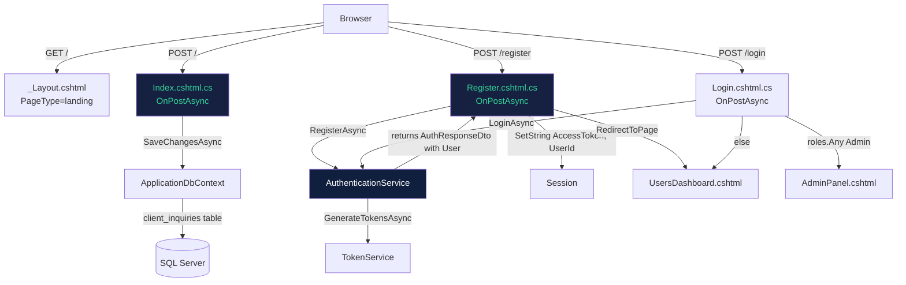
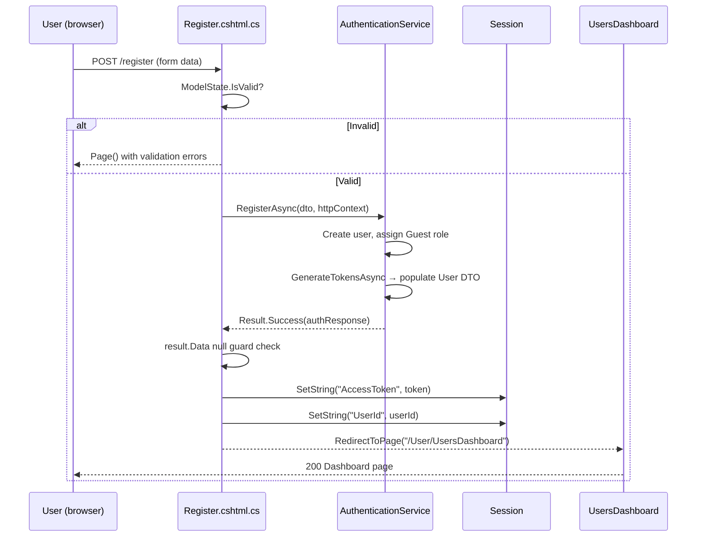

# Design Document: Boosting Hub UI Overhaul

## Overview

This document describes the technical design for the Boosting Hub UI overhaul. The work spans nine discrete requirements across four concern areas: **database schema fixes** (Reqs 1 & 4 migrations), **global CSS theme replacement** (Reqs 2, 3, 5, 6), **feature additions** (Req 4 inquiry form, Req 6 topnav), and **backend behaviour fixes** (Reqs 7, 8, 9). The unifying visual change is a full palette swap from indigo/gold to a deep-navy + emerald green design system. No external libraries are added; all changes are within the existing ASP.NET Core Razor Pages / EF Core / Chart.js stack.

---

## 1. Component / File Change Map

| # | Requirement | Files Changed | New Files |
|---|---|---|---|
| 1 | DB migration fix – campaigns columns | `AlterCampaignsAddNewColumns.cs`, `ApplicationDbContextModelSnapshot.cs` | — |
| 2 | Global theme (site.css) | `wwwroot/css/site.css` | — |
| 3 | Landing page CSS theme | `wwwroot/css/landing.css` | — |
| 4 | Client Inquiry form | `frontend/Pages/Shared/_Layout.cshtml`, `frontend/Pages/Index.cshtml` (new page model), `backend/Data/ApplicationDbContext.cs`, `backend/Models/ClientInquiry.cs` (new), `backend/Data/Migrations/AddClientInquiriesTable.cs` (new), `ApplicationDbContextModelSnapshot.cs`, `frontend/Pages/Index.cshtml.cs` (new) | `ClientInquiry.cs`, `AddClientInquiriesTable.cs`, `Index.cshtml.cs` |
| 5 | Auth pages redesign | `wwwroot/css/auth.css`, `frontend/Pages/Account/Login.cshtml`, `frontend/Pages/Account/Register.cshtml` | — |
| 6 | Dashboard redesign | `frontend/Pages/User/UsersDashboard.cshtml`, `wwwroot/css/dashboard.css` | — |
| 7 | Auto-redirect after registration | `frontend/Pages/Account/Register.cshtml.cs`, `backend/Services/Implementations/AuthenticationService.cs` | — |
| 8 | Admin login routing (document only) | `frontend/Pages/Account/Login.cshtml.cs` (no change — locked) | — |
| 9 | Security page sidebar fix | `frontend/Pages/Account/SecuritySettings.cshtml` | — |


---

## 2. Architecture Overview



---

## 3. CSS Architecture & Variable Inheritance

### 3.1 Design Token Strategy

All colour decisions flow from a single source of truth in `site.css`. Every other stylesheet (`landing.css`, `auth.css`, `dashboard.css`, `tasks.css`) inherits these tokens via the CSS cascade — no stylesheet redeclares a colour directly if a `var()` already resolves it.

**New token map (`site.css :root`):**

```css
:root {
    /* Primary – emerald */
    --primary:        #10B981;
    --primary-dark:   #059669;
    --primary-light:  #34D399;
    --primary-glow:   rgba(16, 185, 129, 0.25);
    --shadow-glow:    0 8px 32px rgba(16, 185, 129, 0.2);

    /* Surfaces – deep navy */
    --bg-base:        #0A1628;
    --bg-surface:     #0F1F3D;
    --bg-card:        #162040;
    --bg-elevated:    #1A2B50;

    /* Text */
    --text-primary:   #FFFFFF;
    --text-secondary: rgba(255, 255, 255, 0.7);
    --text-muted:     rgba(255, 255, 255, 0.45);

    /* Sidebar */
    --sidebar-active: rgba(16, 185, 129, 0.12);

    /* Unchanged tokens */
    --success:        #22d3a5;
    --danger:         #f87171;
    --warning:        #fbbf24;
    --info:           #38bdf8;
    --radius-card:    16px;
    --radius-btn:     12px;
    --shadow-card:    0 4px 24px rgba(0, 0, 0, 0.35);
    --border-subtle:  rgba(255, 255, 255, 0.07);
    --border-muted:   rgba(255, 255, 255, 0.12);
}
```


### 3.2 Auth-page Body Background (site.css)

The `body.auth-page-body` rule changes from the old indigo radial gradient to:

```css
body.auth-page-body {
    background:
        radial-gradient(circle at 20% 50%, rgba(16, 185, 129, 0.12) 0%, transparent 60%),
        radial-gradient(circle at 80% 50%, rgba(16, 185, 129, 0.08) 0%, transparent 60%),
        #0A1628;
}
```

### 3.3 Light Mode Overrides (site.css)

```css
body.light-mode {
    --bg-base:       #F8FAFC;
    --bg-surface:    #FFFFFF;
    --bg-card:       #FFFFFF;
    --text-primary:  #1A202C;
    --text-secondary:#4A5568;
    --primary:       #059669;   /* darker emerald for contrast on white */
}
```

### 3.4 landing.css Gold-to-Emerald Replacement Map

Every literal gold hex is a direct swap — no structural rules change:

| Old value | New value | Usage |
|-----------|-----------|-------|
| `#D09010` | `#10B981` | Primary buttons, badge bg, hero glows, CTA bg |
| `#B07D10` | `#059669` | Dark variant of above |
| `#F0B030` | `#34D399` | Light/highlight variant |
| `rgba(208,144,16,X)` | `rgba(16,185,129,X)` | Glow alphas (preserve X) |

### 3.5 auth.css Colour Replacement Map

| Old value | New value | Usage |
|-----------|-----------|-------|
| `#6366f1` | `#10B981` | Focus border, buttons, links |
| `#818cf8` | `#34D399` | Light indigo references |
| `#4f46e5` | `#059669` | Dark indigo gradient stops |
| `#B07D10` | `#059669` | Old gold link hover |
| `rgba(99,102,241,X)` | `rgba(16,185,129,X)` | All alpha glow values |

### 3.6 dashboard.css Colour Replacement Map

| Old value | New value |
|-----------|-----------|
| `#6366f1` | `#10B981` |
| `rgba(99,102,241,X)` | `rgba(16,185,129,X)` |
| `.sidebar-link.active` background gradient | `rgba(16,185,129,0.12)` flat (uses `--sidebar-active`) |

Additionally, `.admin-main { margin-left: 0 }` replaces `margin-left: 256px` because the sidebar is removed from user-facing pages (see §8).


---

## 4. Req 1 – DB Migration Fix

### 4.1 Context

The `Campaign` model already declares `TargetQuantity` and `CompletedQuantity` properties and the model snapshot already reflects them (confirmed by reading `ApplicationDbContextModelSnapshot.cs`). The migration file `AlterCampaignsAddNewColumns.cs` has never been committed with `Up()`/`Down()` bodies — those methods are empty stubs. The snapshot is already correct so **no snapshot changes are needed**; only the migration body needs to be filled in.

### 4.2 Migration File: `AlterCampaignsAddNewColumns.cs`

The file timestamp is `20260701133926`. The `Up()` and `Down()` methods must be:

```csharp
protected override void Up(MigrationBuilder migrationBuilder)
{
    migrationBuilder.AddColumn<int>(
        name: "target_quantity",
        table: "campaigns",
        type: "int",
        nullable: false,
        defaultValue: 0);

    migrationBuilder.AddColumn<int>(
        name: "completed_quantity",
        table: "campaigns",
        type: "int",
        nullable: false,
        defaultValue: 0);
}

protected override void Down(MigrationBuilder migrationBuilder)
{
    migrationBuilder.DropColumn(
        name: "target_quantity",
        table: "campaigns");

    migrationBuilder.DropColumn(
        name: "completed_quantity",
        table: "campaigns");
}
```

> **Note on idempotency:** EF Core's `DropColumn` in a `Down()` migration does not check for column existence before attempting the drop — that is by design. The `Down()` should only be run when the `Up()` was previously applied, which guarantees the columns exist at that point. No additional guard is needed.

### 4.3 Snapshot State

The snapshot already contains both properties on `Campaign` with the correct column names. No changes to `ApplicationDbContextModelSnapshot.cs` are required for Req 1.

---

## 5. Req 4 – Client Inquiry Form

### 5.1 Data Model

**New file:** `backend/Models/ClientInquiry.cs`

```csharp
using System.ComponentModel.DataAnnotations;
using System.ComponentModel.DataAnnotations.Schema;

namespace BoostingHub.backend.Models;

[Table("client_inquiries")]
public class ClientInquiry
{
    [Key]
    [Column("id")]
    public int Id { get; set; }

    [Required]
    [MaxLength(50)]
    [Column("platform")]
    public string Platform { get; set; } = string.Empty;

    [Required]
    [MaxLength(50)]
    [Column("service_type")]
    public string ServiceType { get; set; } = string.Empty;

    [Column("quantity")]
    public int Quantity { get; set; }

    [Required]
    [MaxLength(500)]
    [Column("target_url")]
    public string TargetUrl { get; set; } = string.Empty;

    [Column("budget")]
    public decimal Budget { get; set; }

    [MaxLength(1000)]
    [Column("notes")]
    public string? Notes { get; set; }

    [Column("created_at")]
    public DateTime CreatedAt { get; set; } = DateTime.UtcNow;
}
```


### 5.2 ApplicationDbContext Changes

Two additions to `ApplicationDbContext.cs`:

1. **DbSet property** (alongside existing sets):
```csharp
public DbSet<ClientInquiry> ClientInquiries { get; set; }
```

2. **Fluent configuration** in `OnModelCreating`:
```csharp
builder.Entity<ClientInquiry>(e =>
{
    e.ToTable("client_inquiries");
    e.Property(c => c.Platform).HasMaxLength(50).IsRequired();
    e.Property(c => c.ServiceType).HasMaxLength(50).IsRequired();
    e.Property(c => c.TargetUrl).HasMaxLength(500).IsRequired();
    e.Property(c => c.Budget).HasColumnType("decimal(18,2)");
    e.Property(c => c.Notes).HasMaxLength(1000);
});
```

### 5.3 Migration: `AddClientInquiriesTable`

**New file:** `backend/Data/Migrations/AddClientInquiriesTable.cs`

```csharp
public partial class AddClientInquiriesTable : Migration
{
    protected override void Up(MigrationBuilder migrationBuilder)
    {
        migrationBuilder.CreateTable(
            name: "client_inquiries",
            columns: table => new
            {
                id = table.Column<int>(nullable: false)
                    .Annotation("SqlServer:Identity", "1, 1"),
                platform = table.Column<string>(maxLength: 50, nullable: false),
                service_type = table.Column<string>(maxLength: 50, nullable: false),
                quantity = table.Column<int>(nullable: false),
                target_url = table.Column<string>(maxLength: 500, nullable: false),
                budget = table.Column<decimal>(type: "decimal(18,2)", nullable: false),
                notes = table.Column<string>(maxLength: 1000, nullable: true),
                created_at = table.Column<DateTime>(nullable: false)
            },
            constraints: table =>
            {
                table.PrimaryKey("PK_client_inquiries", x => x.id);
            });
    }

    protected override void Down(MigrationBuilder migrationBuilder)
    {
        migrationBuilder.DropTable(name: "client_inquiries");
    }
}
```

The migration timestamp follows the existing naming convention (e.g., `20260702000000_AddClientInquiriesTable.cs`).

### 5.4 Index.cshtml Page Model Architecture

**Context:** The current `Index.cshtml` does not exist as a Razor Page — the landing page is rendered entirely through `_Layout.cshtml` when `PageType == "landing"`. The inquiry form POST target must be a Razor Page handler.

**Strategy:** Create `frontend/Pages/Index.cshtml` and `frontend/Pages/Index.cshtml.cs` as a proper Razor Page at route `/`. The page's `OnGetAsync` renders normally. `OnPostAsync` handles the form submission.

**New file:** `frontend/Pages/Index.cshtml.cs`

```csharp
using System.ComponentModel.DataAnnotations;
using BoostingHub.backend.Data;
using BoostingHub.backend.Models;
using Microsoft.AspNetCore.Mvc;
using Microsoft.AspNetCore.Mvc.RazorPages;

namespace BoostingHub.frontend.Pages;

public class IndexModel : PageModel
{
    private readonly ApplicationDbContext _db;

    public IndexModel(ApplicationDbContext db)
    {
        _db = db;
    }

    [BindProperty]
    public InquiryInputModel Inquiry { get; set; } = new();

    public bool ShowSuccess { get; set; }

    public void OnGet() { }

    public async Task<IActionResult> OnPostAsync()
    {
        if (!ModelState.IsValid)
            return Page();

        var entity = new ClientInquiry
        {
            Platform    = Inquiry.Platform,
            ServiceType = Inquiry.ServiceType,
            Quantity    = Inquiry.Quantity,
            TargetUrl   = Inquiry.TargetUrl,
            Budget      = Inquiry.Budget,
            Notes       = Inquiry.Notes,
            CreatedAt   = DateTime.UtcNow
        };

        _db.ClientInquiries.Add(entity);
        await _db.SaveChangesAsync();

        ShowSuccess = true;
        ModelState.Clear();
        Inquiry = new InquiryInputModel();   // clear form fields
        return Page();
    }
}

public class InquiryInputModel
{
    [Required(ErrorMessage = "Platform is required")]
    [MaxLength(50)]
    public string Platform { get; set; } = string.Empty;

    [Required(ErrorMessage = "Service Type is required")]
    [MaxLength(50)]
    public string ServiceType { get; set; } = string.Empty;

    [Required(ErrorMessage = "Quantity is required")]
    [Range(100, 1_000_000, ErrorMessage = "Quantity must be between 100 and 1,000,000")]
    public int Quantity { get; set; }

    [Required(ErrorMessage = "Target URL is required")]
    [Url(ErrorMessage = "Must be a valid URL")]
    [MaxLength(500)]
    public string TargetUrl { get; set; } = string.Empty;

    [Required(ErrorMessage = "Budget is required")]
    [Range(0.01, 999_999.99, ErrorMessage = "Budget must be between 0.01 and 999,999.99")]
    public decimal Budget { get; set; }

    [MaxLength(1000, ErrorMessage = "Notes cannot exceed 1000 characters")]
    public string? Notes { get; set; }
}
```


### 5.5 Landing Page Section (`_Layout.cshtml`)

The `get-started` section is injected **between** `#stats` and `.cta-section` in the landing body inside `_Layout.cshtml`. The `<form>` posts to the current page (`method="post"`) and uses asp-for tag helpers against `Model.Inquiry.*`. Inline validation errors use `<span asp-validation-for>`.

```html
<section class="inquiry-section" id="get-started">
  <div class="section-header">
    <div class="section-label"><i class="bi bi-send"></i> Get Started</div>
    <h2 class="section-title section-title-light">Submit Your Requirements</h2>
    <p class="section-subtitle">Tell us what you need and we'll get back to you shortly.</p>
  </div>
  <div class="inquiry-card">
    @if (Model.ShowSuccess)
    {
      <div class="inquiry-success-msg">
        <i class="bi bi-check-circle-fill"></i>
        Your request has been submitted! We'll get back to you shortly.
      </div>
    }
    <form method="post">
      @Html.AntiForgeryToken()
      <!-- Platform, ServiceType, Quantity, TargetUrl, Budget, Notes fields -->
      <!-- Each field: label + input + <span asp-validation-for> -->
      <button type="submit" class="btn-hero-primary w-100">
        <i class="bi bi-send"></i> Submit Request
      </button>
    </form>
  </div>
</section>
```

**Important architectural note:** Because `_Layout.cshtml` renders as part of the Razor Page at `/`, the `@model` directive in `Index.cshtml` must be `IndexModel` and `_Layout.cshtml` will have access to `Model` when rendering the landing section. The form fields use `asp-for="Inquiry.Platform"` etc. Since `_Layout.cshtml` is shared and doesn't know about page models, the inquiry section HTML should live in `Index.cshtml` itself (rendered via `@RenderBody()`), not in `_Layout.cshtml` — or alternatively in a partial `_InquiryForm.cshtml`. The cleanest approach is: place the `get-started` section in `Index.cshtml` body content (which `_Layout.cshtml`'s `@RenderBody()` renders), not hardcoded in `_Layout.cshtml`.

> **Revised placement:** The `#get-started` section HTML lives inside `frontend/Pages/Index.cshtml` rendered body, not inside `_Layout.cshtml`. The `_Layout.cshtml` landing block only contains the hero, features, stats, and CTA sections as static HTML without form model bindings. This avoids the model-mismatch problem where `_Layout.cshtml` cannot bind to a page-specific model.

---

## 6. Req 5 – Auth Pages Redesign

### 6.1 Layout Change: Split Panel → Single Card

**Current structure:**
```html
<div class="auth-page">
  <div class="auth-container">          <!-- two-column flex -->
    <div class="auth-brand">...</div>   <!-- left branding panel -->
    <div class="auth-form">...</div>    <!-- right form panel -->
  </div>
</div>
```

**New structure:**
```html
<div class="auth-page">
  <div class="auth-card">              <!-- single centered card -->
    
    <h3 class="auth-form-title">Sign In</h3>
    <p class="auth-form-subtitle">...</p>
    <!-- all form content here, no branding panel -->
  </div>
</div>
```

The `.auth-container`, `.auth-brand`, `.auth-brand-content`, `.auth-brand-icon`, `.auth-form` wrappers are removed from both `Login.cshtml` and `Register.cshtml`. All existing `<form>`, `asp-for`, `asp-validation-for`, error blocks, and footer links are preserved inside `.auth-card`.

### 6.2 auth-card CSS Spec

```css
.auth-card {
    width: 100%;
    max-width: 440px;
    background: #FFFFFF;
    border-radius: 24px;
    border-top: 4px solid #10B981;
    box-shadow: 0 20px 60px rgba(0, 0, 0, 0.25);
    padding: 40px;
    position: relative;
    z-index: 1;
    animation: authSlideUp 0.5s ease-out;
}
```

### 6.3 Input Focus State

```css
.input-icon-wrapper .form-control:focus,
.input-icon-wrapper .form-select:focus {
    border-color: #10B981;
    box-shadow: 0 0 0 4px rgba(16, 185, 129, 0.15);
}
```

### 6.4 Submit Button

```css
.btn-auth {
    background: linear-gradient(135deg, #10B981 0%, #059669 100%);
    border: none;
    color: #fff;
}
.btn-auth:hover {
    transform: translateY(-2px);
    box-shadow: 0 8px 25px rgba(16, 185, 129, 0.35);
}
```


---

## 7. Req 6 – Dashboard Redesign

### 7.1 Topnav Replacement

The `<aside class="admin-sidebar user-sidebar">` block in `UsersDashboard.cshtml` is **removed entirely** and replaced with:

```html
<nav class="dash-topnav">
  <a href="/" class="topnav-brand">
    
    <span>Boosting Hub</span>
  </a>
  <div class="topnav-links">
    <a href="/dashboard" class="topnav-link active">
      <i class="bi bi-speedometer2"></i> Dashboard
    </a>
    <a href="/tasks" class="topnav-link">
      <i class="bi bi-list-task"></i> Available Tasks
    </a>
    <a href="/security" class="topnav-link">
      <i class="bi bi-shield-lock"></i> Security
    </a>
  </div>
  <div class="topnav-right">
    <button id="themeToggle" class="btn btn-sm btn-outline-primary border-0" aria-label="Toggle Theme">
      <i class="bi bi-moon-stars fs-5"></i>
    </button>
    <span class="admin-user-badge">
      <i class="bi bi-person-circle"></i> @Model.Dashboard.UserName
    </span>
    <a href="/logout" class="topnav-link topnav-logout">
      <i class="bi bi-box-arrow-right"></i>
    </a>
  </div>
  <!-- Mobile hamburger -->
  <button class="topnav-hamburger" id="topnavHamburger" aria-label="Menu">
    <i class="bi bi-list"></i>
  </button>
</nav>
```

The `.admin-layout` flex container remains but without the sidebar child. `.admin-main` needs `margin-left: 0` in the CSS.

### 7.2 Stat Card Gradient Backgrounds

Each stat card gets an inline style gradient replacing the icon-coloured background approach:

```html
<!-- Total Tasks – emerald -->
<div class="stat-card stat-card-gradient" style="background: linear-gradient(135deg, #10B981 0%, #059669 100%);">
  <div class="stat-icon"><i class="bi bi-list-task"></i></div>
  <div class="stat-info">
    <span class="stat-label">Total Tasks</span>
    <span class="stat-value">@Model.Dashboard.TotalTasks</span>
  </div>
</div>

<!-- Completed – blue -->
<div class="stat-card stat-card-gradient" style="background: linear-gradient(135deg, #3B82F6 0%, #1D4ED8 100%);">

<!-- Pending – amber -->
<div class="stat-card stat-card-gradient" style="background: linear-gradient(135deg, #F59E0B 0%, #D97706 100%);">

<!-- Rewards – purple -->
<div class="stat-card stat-card-gradient" style="background: linear-gradient(135deg, #8B5CF6 0%, #6D28D9 100%);">
```

A `.stat-card-gradient` CSS rule ensures text and icons use white:

```css
.stat-card-gradient,
.stat-card-gradient .stat-label,
.stat-card-gradient .stat-value,
.stat-card-gradient .stat-icon { color: #fff !important; }
.stat-card-gradient .stat-icon { background: rgba(255,255,255,0.18); }
```

### 7.3 Chart Colours

In the `<script>` block of `UsersDashboard.cshtml`, update the line chart dataset:

```js
datasets: [{
    label: 'Tasks',
    data: lineData,
    borderColor: '#10B981',
    backgroundColor: 'rgba(16,185,129,0.1)',
    fill: true,
    tension: 0.4
}]
```

### 7.4 dash-topnav CSS

New rules added to `dashboard.css`:

```css
.dash-topnav {
    display: flex;
    align-items: center;
    gap: 8px;
    padding: 0 24px;
    height: 64px;
    background: var(--bg-surface);
    border-bottom: 1px solid var(--border-subtle);
    position: sticky;
    top: 0;
    z-index: 100;
    width: 100%;
}
.topnav-brand {
    display: flex;
    align-items: center;
    gap: 10px;
    text-decoration: none;
    font-weight: 700;
    color: var(--text-primary);
    margin-right: 24px;
    flex-shrink: 0;
}
.topnav-links {
    display: flex;
    align-items: center;
    gap: 4px;
    flex: 1;
}
.topnav-link {
    display: inline-flex;
    align-items: center;
    gap: 7px;
    padding: 8px 14px;
    border-radius: 8px;
    color: var(--text-secondary);
    text-decoration: none;
    font-size: 0.875rem;
    font-weight: 500;
    transition: all 0.2s;
}
.topnav-link:hover { background: rgba(16,185,129,0.08); color: var(--primary-light); }
.topnav-link.active {
    background: var(--sidebar-active);
    color: var(--primary-light);
    font-weight: 600;
}
.topnav-right {
    display: flex;
    align-items: center;
    gap: 12px;
    margin-left: auto;
}
.topnav-hamburger {
    display: none;
    background: none;
    border: none;
    color: var(--text-primary);
    font-size: 1.5rem;
    cursor: pointer;
}
/* Remove sidebar margin from main content */
.admin-main { margin-left: 0; }

@media (max-width: 768px) {
    .topnav-links { display: none; }
    .topnav-hamburger { display: block; }
    .topnav-links.open {
        display: flex;
        flex-direction: column;
        position: absolute;
        top: 64px;
        left: 0;
        right: 0;
        background: var(--bg-surface);
        border-bottom: 1px solid var(--border-subtle);
        padding: 12px 16px;
        z-index: 99;
    }
}
```


---

## 8. Req 7 – Auto-Redirect After Registration

### 8.1 AuthenticationService.RegisterAsync Change

The current `RegisterAsync` returns `Result.Success(authResponse, ...)` but leaves `authResponse.User` null (unlike `LoginAsync` which populates it). The fix mirrors the login path — after generating tokens, populate `authResponse.User` before returning:

```csharp
// After: var authResponse = await _tokenService.GenerateTokensAsync(user);

var userWithRoles = await _db.Users
    .Include(u => u.UserHasRoles)
    .ThenInclude(ur => ur.Role)
    .FirstOrDefaultAsync(u => u.Id == user.Id, ct);

authResponse.User = new UserDto
{
    Id     = user.Id,
    Name   = user.Name,
    Email  = user.Email,
    Phone  = user.Phone,
    Status = user.Status == 1 ? "Active" : "Inactive",
    EmailVerifiedAt = user.EmailVerifiedAt,
    Roles  = userWithRoles!.UserHasRoles.Select(ur => ur.Role!.RoleTitle).ToArray()
};

return Result.Success(authResponse, "Registration successful.");
```

### 8.2 Register.cshtml.cs OnPostAsync Change

```csharp
public async Task<IActionResult> OnPostAsync()
{
    if (!ModelState.IsValid) return Page();

    var result = await _authService.RegisterAsync(Input, HttpContext);

    if (result.IsSuccess)
    {
        // Guard: treat null data or null User as a registration failure
        if (result.Data == null || result.Data.User == null)
        {
            ErrorMessage = "Registration completed but session could not be initialised. Please log in.";
            return Page();
        }

        HttpContext.Session.SetString("AccessToken", result.Data.AccessToken ?? "");
        HttpContext.Session.SetString("UserId", result.Data.User.Id.ToString());
        return RedirectToPage("/User/UsersDashboard");
    }

    ErrorMessage = result.Message;
    Errors = result.Errors;
    return Page();
}
```

**Flow diagram:**



---

## 9. Req 8 – Admin Login Routing (Documentation Lock)

The `Login.cshtml.cs` `OnPostAsync` already contains the correct conditional:

```csharp
var roles = result.Data?.User?.Roles ?? Array.Empty<string>();
if (roles.Any(r => r.Contains("Admin")))
    return RedirectToPage("/Admin/AdminPanel");

return RedirectToPage("/User/UsersDashboard");
```

**Design decision:** This logic is correct and must not be changed. The `r.Contains("Admin")` check is case-sensitive on the .NET string, but role titles are seeded as `"Admin"` (capital A) via `AdminSeeder.cs`, so case sensitivity is not an issue. No code changes are made to `Login.cshtml.cs`.

> **Guard:** If in future a role titled `"administrator"` (lowercase) is added, the Contains check would miss it. That is considered out of scope for this overhaul.

---

## 10. Req 9 – Security Page Sidebar Fix

### 10.1 Sidebar Consistency Pattern

All three user-facing pages (`UsersDashboard`, `Tasks/Index`, `SecuritySettings`) share an identical sidebar structure. The current `SecuritySettings.cshtml` sidebar is missing the "Available Tasks" link, causing navigation inconsistency.

**Target consistent sidebar structure (all three pages):**

```html
<aside class="admin-sidebar user-sidebar">
  <div class="sidebar-brand">
    
    <span>Boosting Hub</span>
  </div>
  <nav class="sidebar-nav">
    <a href="/dashboard" class="sidebar-link [active if dashboard]">
      <i class="bi bi-speedometer2"></i> Dashboard
    </a>
    <a href="/tasks" class="sidebar-link [active if tasks]">
      <i class="bi bi-list-task"></i> Available Tasks
    </a>
    <a href="/security" class="sidebar-link [active if security]">
      <i class="bi bi-shield-lock"></i> Security
    </a>
    <div class="sidebar-divider"></div>
    <a href="/logout" class="sidebar-link sidebar-logout">
      <i class="bi bi-box-arrow-right"></i> Logout
    </a>
  </nav>
</aside>
```

**Change to `SecuritySettings.cshtml`:** Add the "Available Tasks" link between the Dashboard and Security links. The Security link retains `class="sidebar-link active"`. The Available Tasks link has `class="sidebar-link"` (no active class).

> **Future consideration:** Once the dashboard switches to the topnav layout (Req 6), these sidebar pages (`Tasks/Index`, `SecuritySettings`) should also be converted for visual consistency. However, Req 6 explicitly targets only `UsersDashboard.cshtml`, so the sidebar on Tasks and Security pages is left in place for this iteration. The sidebar CSS in `dashboard.css` is retained for those pages.


---

## 11. Migration Strategy

### 11.1 Migration Execution Order

The application uses `db.Database.Migrate()` on startup in `Program.cs`. Migrations run in timestamp order:

1. ... (existing 12 migrations)
2. `20260701133926_AlterCampaignsAddNewColumns` — fills in `target_quantity` and `completed_quantity` on `campaigns` table *(body was empty; now populated)*
3. `20260702000000_AddClientInquiriesTable` *(new)* — creates `client_inquiries` table

### 11.2 Snapshot Update for ClientInquiry

After generating the `AddClientInquiriesTable` migration via `dotnet ef migrations add`, EF Core will update `ApplicationDbContextModelSnapshot.cs` automatically to include:

```csharp
modelBuilder.Entity("BoostingHub.backend.Models.ClientInquiry", b =>
{
    b.Property<int>("Id")
        .ValueGeneratedOnAdd()
        .HasColumnType("int")
        .HasColumnName("id");
    SqlServerPropertyBuilderExtensions.UseIdentityColumn(b.Property<int>("Id"));

    b.Property<decimal>("Budget")
        .HasColumnType("decimal(18,2)")
        .HasColumnName("budget");

    b.Property<DateTime>("CreatedAt")
        .HasColumnType("datetime2")
        .HasColumnName("created_at");

    b.Property<string>("Notes")
        .HasMaxLength(1000)
        .HasColumnType("nvarchar(1000)")
        .HasColumnName("notes");

    b.Property<string>("Platform")
        .IsRequired()
        .HasMaxLength(50)
        .HasColumnType("nvarchar(50)")
        .HasColumnName("platform");

    b.Property<int>("Quantity")
        .HasColumnType("int")
        .HasColumnName("quantity");

    b.Property<string>("ServiceType")
        .IsRequired()
        .HasMaxLength(50)
        .HasColumnType("nvarchar(50)")
        .HasColumnName("service_type");

    b.Property<string>("TargetUrl")
        .IsRequired()
        .HasMaxLength(500)
        .HasColumnType("nvarchar(500)")
        .HasColumnName("target_url");

    b.HasKey("Id");
    b.ToTable("client_inquiries");
});
```

### 11.3 Migration CLI Commands

```bash
# Generate the new migration (run from project root)
dotnet ef migrations add AddClientInquiriesTable \
  --project "boosting hub" \
  --startup-project "boosting hub"

# Apply all pending migrations
dotnet ef database update
```

The `AlterCampaignsAddNewColumns` migration body is hand-edited (not regenerated) since the model snapshot already reflects its intended state.

---

## 12. Correctness Properties

The following invariants must hold after implementation:

- **P1 (Migration idempotency):** Running `db.Database.Migrate()` twice on a database that already has `target_quantity` and `completed_quantity` SHALL NOT throw; EF Core tracks applied migrations in `__EFMigrationsHistory`.
- **P2 (Inquiry form data integrity):** For all `ClientInquiry` records in the database, `Platform` ∈ {Instagram, YouTube, TikTok, Twitter, Facebook}, `Quantity` ∈ [100, 1,000,000], `Budget` > 0, `TargetUrl` is a non-empty string, and `CreatedAt` is a UTC timestamp.
- **P3 (Session completeness after registration):** If `OnPostAsync` redirects to `/User/UsersDashboard`, then `Session["AccessToken"]` is non-empty AND `Session["UserId"]` is a positive integer string.
- **P4 (No session pollution on failure):** If `OnPostAsync` returns `Page()` (validation failure or service failure), then `Session["AccessToken"]` and `Session["UserId"]` are NOT set.
- **P5 (Admin routing stability):** For any login where `result.Data.User.Roles` contains a string with substring `"Admin"`, the redirect target is `/Admin/AdminPanel`. For all other successful logins the redirect target is `/User/UsersDashboard`.
- **P6 (Sidebar link parity):** All three pages (`/dashboard`, `/tasks`, `/security`) expose the same three sidebar/topnav navigation links (Dashboard, Available Tasks, Security) with exactly one of them having the `active` class — the one matching the current page.
- **P7 (CSS variable coverage):** After the theme swap, no CSS file under `/wwwroot/css/` contains the literal strings `#6366f1`, `#818cf8`, `#4f46e5`, `#D09010`, `#B07D10`, or `#F0B030`.

---

## 13. Error Handling

| Scenario | Handling |
|---|---|
| `db.Database.Migrate()` throws on startup | `Program.cs` wraps in try/catch; logs exception via `ILogger`; `app.Run()` is not called so the process exits cleanly |
| `ClientInquiries.SaveChangesAsync` throws | `OnPostAsync` does not catch — ASP.NET Core's exception middleware returns 500; no partial data is committed (single `SaveChangesAsync` call) |
| `RegisterAsync` returns success but `result.Data` is null | `Register.cshtml.cs` sets `ErrorMessage` and returns `Page()` — prevents NullReferenceException and session pollution |
| Form submitted with invalid `TargetUrl` | `[Url]` data annotation triggers ModelState error; `Page()` is returned with validation message adjacent to the field |
| Auth page loaded with no session | `UsersDashboard.cshtml.cs` reads `Session["UserId"]`; if null/empty, `Dashboard` stays empty DTO — no crash, empty stats shown. A future requirement may add redirect-to-login guard |

---

## 14. Testing Strategy

### Unit tests
- `RegisterAsync` populates `authResponse.User` — assert `result.Data.User.Id > 0` after calling with valid DTO.
- `Register.cshtml.cs OnPostAsync` with `result.Data.User == null` — assert `ErrorMessage` is set and no redirect occurs.
- CSS token replacement — snapshot test comparing token names in `site.css` after overhaul.

### Integration tests
- POST `/` with valid inquiry fields → 200, DB contains one `ClientInquiry` row.
- POST `/` with missing Platform → 200 (page redisplay), `ModelState["Inquiry.Platform"].Errors.Count > 0`, no DB row created.
- POST `/register` with valid new user → session contains `AccessToken` and `UserId`, response redirects to `/dashboard`.

### Manual / visual QA checklist
- [ ] Landing page hero badge, title gradient, CTA button all show emerald (not gold)
- [ ] `#get-started` section appears between stats and CTA
- [ ] Login page shows single centered white card with 4px emerald top border
- [ ] Dashboard shows topnav with three links; sidebar is absent
- [ ] Stat cards show four distinct gradient colours
- [ ] Security page sidebar has three links: Dashboard, Available Tasks (no `active`), Security (`active`)
- [ ] Registering a new user lands directly on dashboard, not login page
- [ ] Admin login routes to `/admin-panel`, not `/dashboard`


---

## Architecture

See §2 (Architecture Overview) for the Mermaid flow diagram covering the landing page inquiry POST, registration redirect flow, and login routing. The application is a monolithic ASP.NET Core Razor Pages app with EF Core (SQL Server) and Blazor Server for the tasks component. No new architectural layers are introduced by this overhaul — all changes are within existing layers (CSS files, Razor Pages, EF Core models/migrations, service implementations).

```mermaid
graph LR
    subgraph Frontend
        Layout[_Layout.cshtml]
        IndexPage[Index.cshtml / IndexModel]
        LoginPage[Login.cshtml / LoginModel]
        RegisterPage[Register.cshtml / RegisterModel]
        Dashboard[UsersDashboard.cshtml]
        Security[SecuritySettings.cshtml]
        Tasks[Tasks/Index.cshtml]
    end

    subgraph Backend
        AuthSvc[AuthenticationService]
        DbCtx[ApplicationDbContext]
    end

    subgraph Database
        campaigns[(campaigns table)]
        client_inquiries[(client_inquiries table)]
    end

    subgraph CSS
        SiteCSS[site.css — tokens]
        LandingCSS[landing.css]
        AuthCSS[auth.css]
        DashCSS[dashboard.css]
    end

    IndexPage --> DbCtx
    RegisterPage --> AuthSvc
    LoginPage --> AuthSvc
    AuthSvc --> DbCtx
    DbCtx --> campaigns
    DbCtx --> client_inquiries
    Layout --> SiteCSS
    Layout --> LandingCSS
    LoginPage --> AuthCSS
    RegisterPage --> AuthCSS
    Dashboard --> DashCSS
    Tasks --> DashCSS
    Security --> DashCSS
```



---

## Components and Interfaces

### Component: IndexModel (new Razor Page Model)

**File:** `frontend/Pages/Index.cshtml.cs`  
**Purpose:** Handles the landing page `GET` and the inquiry form `POST`.

**Interface:**
```csharp
public class IndexModel : PageModel
{
    // Bound form input
    [BindProperty]
    public InquiryInputModel Inquiry { get; set; }

    // Set to true after successful save — triggers success message
    public bool ShowSuccess { get; set; }

    public void OnGet() { }
    public async Task<IActionResult> OnPostAsync() { ... }
}
```

**Responsibilities:**
- Validate `InquiryInputModel` via DataAnnotations and ModelState
- Persist `ClientInquiry` entity on valid POST
- Reset form and set `ShowSuccess = true` on success
- Return `Page()` with preserved inputs and validation errors on failure

---

### Component: ClientInquiry (EF Core Model)

**File:** `backend/Models/ClientInquiry.cs`  
**Purpose:** Represents a prospect's service request.

**Interface:**
```csharp
[Table("client_inquiries")]
public class ClientInquiry
{
    public int Id { get; set; }
    public string Platform { get; set; }     // max 50, required
    public string ServiceType { get; set; }  // max 50, required
    public int Quantity { get; set; }
    public string TargetUrl { get; set; }    // max 500, required
    public decimal Budget { get; set; }      // decimal(18,2)
    public string? Notes { get; set; }       // max 1000, nullable
    public DateTime CreatedAt { get; set; }
}
```

---

### Component: AuthenticationService (modified)

**File:** `backend/Services/Implementations/AuthenticationService.cs`  
**Purpose:** `RegisterAsync` now populates `authResponse.User` on success.

```csharp
public interface IAuthenticationService
{
    Task<Result<AuthResponseDto>> RegisterAsync(RegisterDto dto, HttpContext ctx, CancellationToken ct = default);
    Task<Result<AuthResponseDto>> LoginAsync(LoginDto dto, HttpContext ctx, CancellationToken ct = default);
    // ... other existing methods unchanged
}
```

**Change:** After calling `_tokenService.GenerateTokensAsync(user)`, query `Users` with `UserHasRoles → Role` and populate `authResponse.User` (matching the existing `LoginAsync` pattern).

---

### Component: RegisterModel (modified)

**File:** `frontend/Pages/Account/Register.cshtml.cs`  
**Purpose:** On successful registration, stores session and redirects to dashboard.

```csharp
public class RegisterModel : PageModel
{
    [BindProperty] public RegisterDto Input { get; set; }
    public string? ErrorMessage { get; set; }
    public string[]? Errors { get; set; }

    public void OnGet() { }
    public async Task<IActionResult> OnPostAsync() { ... }
}
```

---

### Component: CSS Theme Layer

The four CSS files form a dependency chain via CSS custom properties (not `@import`):

```
site.css  →  defines :root tokens
               └── landing.css   (uses var() + own literal colours being replaced)
               └── auth.css      (uses var() + own literal colours being replaced)
               └── dashboard.css (uses var() + own literal colours being replaced)
               └── tasks.css     (uses var() only — no changes needed)
```

`tasks.css` already uses only `var()` tokens and needs no changes.

---

## Data Models

### ClientInquiry

| Column | EF Property | SQL Type | Constraints |
|---|---|---|---|
| `id` | `Id` | `int` IDENTITY | PK, not null |
| `platform` | `Platform` | `nvarchar(50)` | not null |
| `service_type` | `ServiceType` | `nvarchar(50)` | not null |
| `quantity` | `Quantity` | `int` | not null |
| `target_url` | `TargetUrl` | `nvarchar(500)` | not null |
| `budget` | `Budget` | `decimal(18,2)` | not null |
| `notes` | `Notes` | `nvarchar(1000)` | nullable |
| `created_at` | `CreatedAt` | `datetime2` | not null |

**Validation rules (enforced at page model layer via DataAnnotations):**
- `Platform`: one of Instagram / YouTube / TikTok / Twitter / Facebook
- `Quantity`: 100–1,000,000
- `TargetUrl`: valid URL format (`[Url]` attribute)
- `Budget`: 0.01–999,999.99

### Campaign (existing — columns added by Req 1)

| Column | EF Property | SQL Type | Constraints |
|---|---|---|---|
| `target_quantity` | `TargetQuantity` | `int` | not null, default 0 |
| `completed_quantity` | `CompletedQuantity` | `int` | not null, default 0 |

These columns already exist in the `Campaign` model class and snapshot; only the migration `Up()`/`Down()` bodies were missing.

---

## Correctness Properties

Property 1: Migration idempotency — running `db.Database.Migrate()` on a database that already has `target_quantity` and `completed_quantity` does not throw; EF Core's `__EFMigrationsHistory` table prevents re-applying already-applied migrations.  
**Validates: Requirements 1.6**

Property 2: Inquiry data integrity — for every `ClientInquiry` row persisted, `Quantity` is between 100 and 1,000,000, `Budget` is greater than zero, `TargetUrl` is a non-empty string, and `CreatedAt` is a UTC datetime.  
**Validates: Requirements 4.3, 4.6**

Property 3: Session completeness after registration — if `Register.cshtml.cs OnPostAsync` redirects to `/User/UsersDashboard`, then `Session["AccessToken"]` is a non-empty string and `Session["UserId"]` is a string representing a positive integer.  
**Validates: Requirements 7.1, 7.2, 7.3**

Property 4: No session pollution on registration failure — if `OnPostAsync` returns `Page()` due to any failure (ModelState invalid, service failure, or null data guard), then `Session["AccessToken"]` and `Session["UserId"]` are not modified.  
**Validates: Requirements 7.4, 7.5, 7.6**

Property 5: Admin routing stability — for any successful login where `result.Data.User.Roles` contains a value with substring `"Admin"`, the redirect target is `/Admin/AdminPanel`; for all other successful logins the target is `/User/UsersDashboard`.  
**Validates: Requirements 8.1, 8.2, 8.3**

Property 6: Sidebar link parity — all three user-facing pages (`/dashboard`, `/tasks`, `/security`) expose the same three navigation destinations (Dashboard, Available Tasks, Security) with exactly one of them marked `active` matching the current page URL.  
**Validates: Requirements 9.1, 9.2, 9.3, 9.4**

Property 7: No legacy colour tokens in CSS — after the theme swap, no file under `/wwwroot/css/` contains the literal strings `#6366f1`, `#818cf8`, `#4f46e5`, `#D09010`, `#B07D10`, or `#F0B030`.  
**Validates: Requirements 2.1, 3.1, 5.1, 6.3**

---

## Error Handling

See §13 (Error Handling) for the full error scenario table.

---

## Testing Strategy

See §14 (Testing Strategy) for unit, integration, and manual QA coverage.
